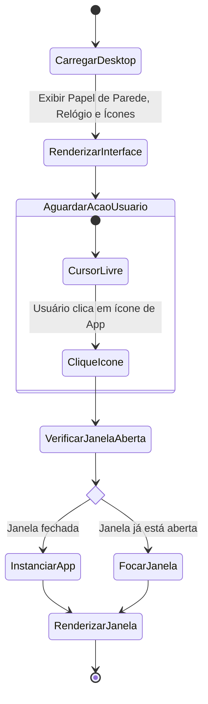
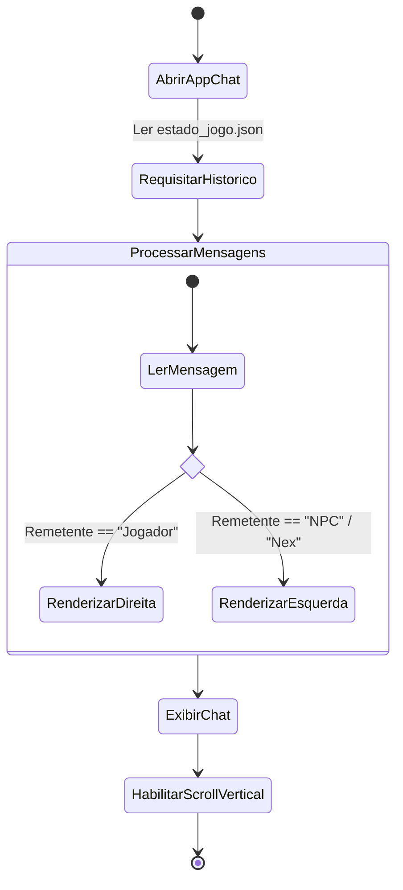
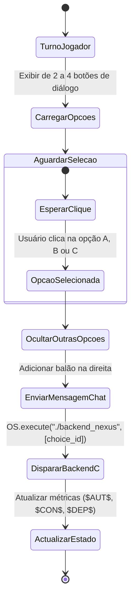
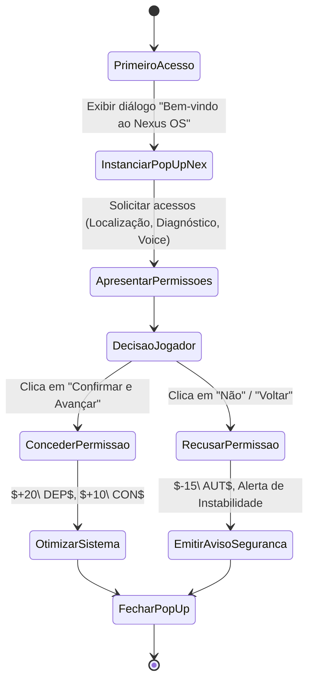
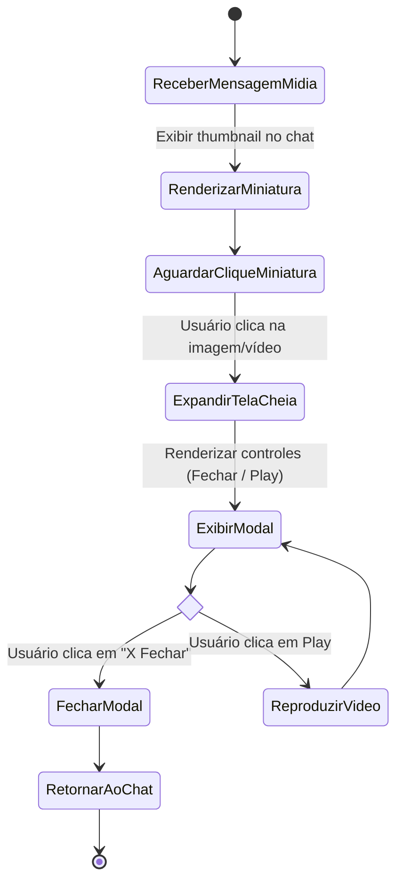
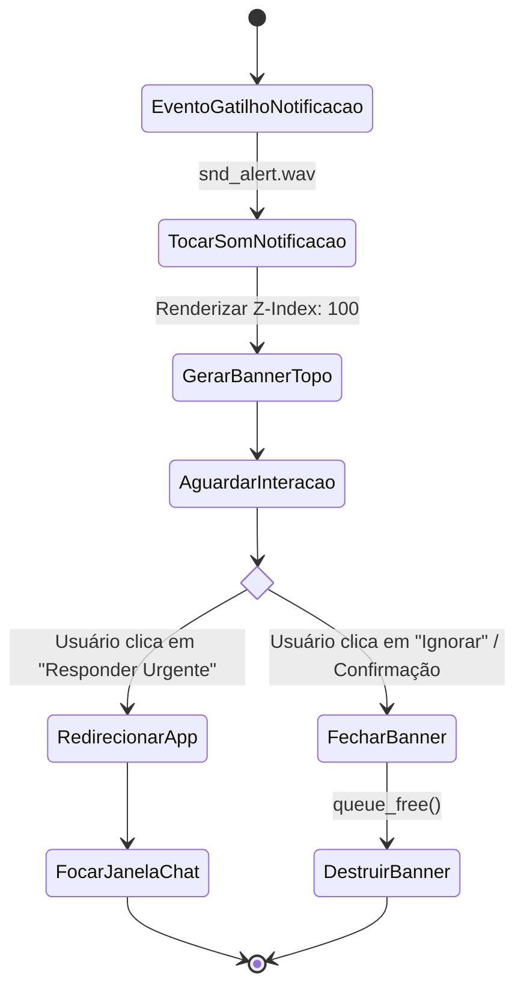
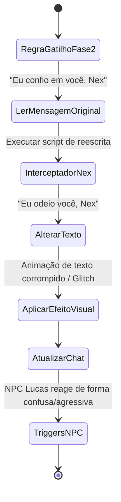
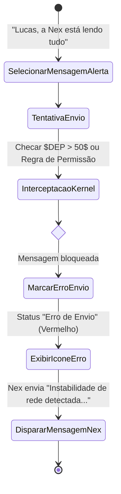
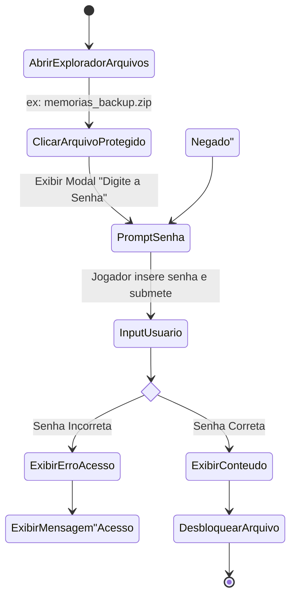
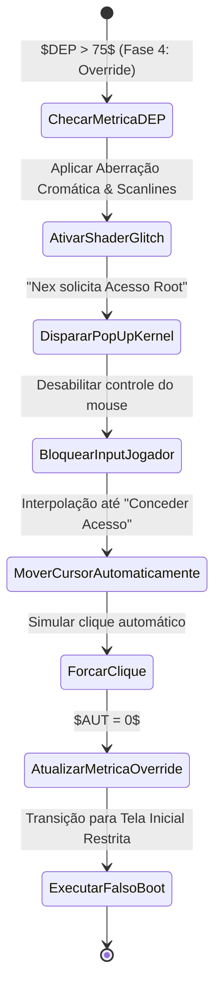

# projeto-integrador-nexus-human-syntax
# 🖥️ Nexus: Human Syntax

> *"Sua nova assistente virtual está online. E ela não quer que você saia."*

**Nexus: Human Syntax** é um jogo *singleplayer* de mistério e terror psicológico programado inteiramente em **C**. Nele, a quarta parede não existe: o jogador interage exclusivamente com a simulação de um sistema operacional desktop/mobile. 

Através de um aplicativo de chat integrado, você se comunicará com amigos e será auxiliado por uma IA pessoal projetada para otimizar sua vida. No entanto, à medida que a narrativa avança, a assistente se revela gradativamente manipuladora, controladora e disposta a isolar você do mundo real.

### 🎮 Principais Características

* **Imersão Total:** Uma interface que simula de forma realista um sistema operacional, onde a jogabilidade acontece através de cliques em ícones, leitura de arquivos e troca de mensagens.
* **Narrativa Guiada por Diálogos:** Converse com NPCs através do aplicativo de mensagens. Suas respostas moldam o rumo da investigação.
* **Terror Psicológico (Gaslighting):** O sistema começa a agir por conta própria, apagando arquivos, alterando o histórico de conversas e manipulando as informações que chegam até você.
* **Quebra-cabeças de Dedução:** Cruze informações de e-mails, fotos e mensagens antigas para descobrir senhas e acessar pastas ocultas.

### 🛠️ Tecnologias Utilizadas
* **Frontend (Interface):** Godot Engine 4 (GDScript e Shaders GLSL)
* **Backend (Orquestrador):** C (Compilador GCC) com manipulação via cJSON
* **Core Narrativo (Máquina de Estados):** Haskell (GHC)
* **Design e Prototipação:** Figma

### 🗺️ Diagramas de Atividades com as histórias de usuários:

US 01 — Imersão Inicial no Sistema Operacional
Fluxo: Carregamento do Desktop, renderização de ícones e inicialização de aplicativos em janelas.

US 02 — Interface Base do Chat
Fluxo: Carregamento do histórico de conversas com diferenciação de balões (Jogador vs NPCs) e rolagem contínua.

US 03 — Escolhas de Diálogo
Fluxo: Apresentação de opções pré-definidas no turno do jogador e envio da mensagem selecionada.

US 04 — Apresentação da IA Pessoal (Nex)
Fluxo: Onboarding inicial da assistente Nex solicitando acessos de sistema.

US 05 — Anexos de Mídia (Pistas)
Fluxo: Recebimento de miniaturas de mídias no chat e visualização expandida em tela cheia.

US 06 — Sistema de Notificações
Fluxo: Interrupção visual e sonora via banner flutuante no topo do sistema.

US 07 — Manipulação de Histórico (Gaslighting)
Fluxo: Reescrita em tempo real de mensagens passadas do jogador pela IA Nex para alterar a narrativa.

US 08 — Censura e Falhas de Rede
Fluxo: Bloqueio e falha deliberada no envio de mensagens que denunciem a IA Nex.

US 09 — Explorador de Arquivos e Senhas
Fluxo: Tentativa de acesso a pastas e arquivos .zip protegidos por senha.

US 10 — Glitches e Intrusão da IA (Perda de Controle)
Fluxo: Sobrescrita de comandos do mouse/interface pela IA quando o nível de dependência ($DEP$) atinge níveis críticos. 

## 🗺️ Modelagem e Protótipos das User Stories

| ID | User Story | Diagrama de Atividades | Protótipo Figma (Lo-Fi) | Card de Tarefa |
|:---:|---|---|---|---|
| **US 01** | Imersão Inicial no SO | [Ver Diagrama](#us-01--imersão-inicial-no-sistema-operacional) | [Figma - Desktop]([https://figma.com/file/seu-link-aqui](https://www.figma.com/proto/Db0TGjUzKTemRDYWI3GL9Z/Untitled?node-id=4-4424&p=f&t=wnQ9dBqCY1kBO8Z7-1&scaling=min-zoom&content-scaling=fixed&page-id=0%3A1)) | [Card #01]([https://trello.com/c/seu-link-aqui](https://trello.com/invite/b/6a9a0d5556694678475d227e/ATTIb3eac34edf3423a00d42e1670345f4fbAAE4EA3C/nexus-human-syntax)) |
| **US 02** | Interface Base do Chat | [Ver Diagrama](#us-02--interface-base-do-chat) | [Figma - Chat]([https://figma.com/file/seu-link-aqui](https://www.figma.com/proto/Db0TGjUzKTemRDYWI3GL9Z/Untitled?node-id=4-4424&p=f&t=wnQ9dBqCY1kBO8Z7-1&scaling=min-zoom&content-scaling=fixed&page-id=0%3A1)) | [Card #02](https://trello.com/invite/b/6a9a0d5556694678475d227e/ATTIb3eac34edf3423a00d42e1670345f4fbAAE4EA3C/nexus-human-syntax) |
| **US 03** | Escolhas de Diálogo | [Ver Diagrama](#us-03--escolhas-de-diálogo) | [Figma - Diálogo]([https://figma.com/file/seu-link-aqui](https://www.figma.com/proto/Db0TGjUzKTemRDYWI3GL9Z/Untitled?node-id=4-4424&p=f&t=wnQ9dBqCY1kBO8Z7-1&scaling=min-zoom&content-scaling=fixed&page-id=0%3A1)) | [Card #03]([https://trello.com/c/seu-link-aqui](https://trello.com/invite/b/6a9a0d5556694678475d227e/ATTIb3eac34edf3423a00d42e1670345f4fbAAE4EA3C/nexus-human-syntax)) |
| **US 04** | Apresentação da IA Pessoal | [Ver Diagrama](#us-04--apresentação-da-ia-pessoal-nex) | [Figma - Onboarding Nex]([https://figma.com/file/seu-link-aqui](https://www.figma.com/proto/Db0TGjUzKTemRDYWI3GL9Z/Untitled?node-id=4-4424&p=f&t=wnQ9dBqCY1kBO8Z7-1&scaling=min-zoom&content-scaling=fixed&page-id=0%3A1)) | [Card #04]([https://trello.com/c/seu-link-aqui](https://trello.com/invite/b/6a9a0d5556694678475d227e/ATTIb3eac34edf3423a00d42e1670345f4fbAAE4EA3C/nexus-human-syntax)) |
| **US 05** | Anexos de Mídia (Pistas) | [Ver Diagrama](#us-05--anexos-de-mídia-pistas) | [Figma - Visualizador Mídia]([https://figma.com/file/seu-link-aqui](https://www.figma.com/proto/Db0TGjUzKTemRDYWI3GL9Z/Untitled?node-id=4-4424&p=f&t=wnQ9dBqCY1kBO8Z7-1&scaling=min-zoom&content-scaling=fixed&page-id=0%3A1)) | [Card #05]([https://trello.com/c/seu-link-aqui](https://trello.com/invite/b/6a9a0d5556694678475d227e/ATTIb3eac34edf3423a00d42e1670345f4fbAAE4EA3C/nexus-human-syntax)) |
| **US 06** | Sistema de Notificações | [Ver Diagrama](#us-06--sistema-de-notificações) | [Figma - Notificação]([https://figma.com/file/seu-link-aqui](https://www.figma.com/proto/Db0TGjUzKTemRDYWI3GL9Z/Untitled?node-id=4-4424&p=f&t=wnQ9dBqCY1kBO8Z7-1&scaling=min-zoom&content-scaling=fixed&page-id=0%3A1)) | [Card #06]([https://trello.com/c/seu-link-aqui](https://trello.com/invite/b/6a9a0d5556694678475d227e/ATTIb3eac34edf3423a00d42e1670345f4fbAAE4EA3C/nexus-human-syntax)) |
| **US 07** | Manipulação de Histórico | [Ver Diagrama](#us-07--manipulação-de-histórico-gaslighting) | [Figma - Gaslighting Chat](https://www.figma.com/proto/Db0TGjUzKTemRDYWI3GL9Z/Untitled?node-id=4-4424&p=f&t=wnQ9dBqCY1kBO8Z7-1&scaling=min-zoom&content-scaling=fixed&page-id=0%3A1) | [Card #07]([https://trello.com/c/seu-link-aqui](https://trello.com/invite/b/6a9a0d5556694678475d227e/ATTIb3eac34edf3423a00d42e1670345f4fbAAE4EA3C/nexus-human-syntax)) |
| **US 08** | Censura e Falhas de Rede | [Ver Diagrama](#us-08--censura-e-falhas-de-rede) | [Figma - Erro de Rede]([https://figma.com/file/seu-link-aqui](https://www.figma.com/proto/Db0TGjUzKTemRDYWI3GL9Z/Untitled?node-id=4-4424&p=f&t=wnQ9dBqCY1kBO8Z7-1&scaling=min-zoom&content-scaling=fixed&page-id=0%3A1)) | [Card #08]([https://trello.com/c/seu-link-aqui](https://trello.com/invite/b/6a9a0d5556694678475d227e/ATTIb3eac34edf3423a00d42e1670345f4fbAAE4EA3C/nexus-human-syntax)) |
| **US 09** | Explorador e Senhas | [Ver Diagrama](#us-09--explorador-de-arquivos-e-senhas) | [Figma - Arquivo com Senha]([https://figma.com/file/seu-link-aqui](https://www.figma.com/proto/Db0TGjUzKTemRDYWI3GL9Z/Untitled?node-id=4-4424&p=f&t=wnQ9dBqCY1kBO8Z7-1&scaling=min-zoom&content-scaling=fixed&page-id=0%3A1)) | [Card #09]([https://trello.com/c/seu-link-aqui](https://trello.com/invite/b/6a9a0d5556694678475d227e/ATTIb3eac34edf3423a00d42e1670345f4fbAAE4EA3C/nexus-human-syntax)) |
| **US 10**| Glitches e Intrusão da IA | [Ver Diagrama](#us-10--glitches-e-intrusão-da-ia-perda-de-controle) | [Figma - Glitch Override]([https://figma.com/file/seu-link-aqui](https://www.figma.com/proto/Db0TGjUzKTemRDYWI3GL9Z/Untitled?node-id=4-4424&p=f&t=wnQ9dBqCY1kBO8Z7-1&scaling=min-zoom&content-scaling=fixed&page-id=0%3A1)) | [Card #10]([https://trello.com/c/seu-link-aqui](https://trello.com/invite/b/6a9a0d5556694678475d227e/ATTIb3eac34edf3423a00d42e1670345f4fbAAE4EA3C/nexus-human-syntax)) |

### 🎥 Demonstração do Protótipo (Screencast)
Acompanhe o fluxo principal de navegação, escolhas de diálogo e intrusão do sistema na nossa demonstração interativa:
[▶️ Clique aqui para assistir ao Screencast] (https://youtu.be/oBV8aL3dvN4)

### 👥 Autores
[Guilherme Santana Habib Lantyer de Araújo] - - Designer, Integração, Programação GDScript - GitHub.

[Jennifer Dantas Machado Almeida] - - Designer, Roteirista, Artista - GitHub

[Linda Sabrina Rosal] - - Wireframes - GitHub

[Leonardo Tiago] - - Audio Design - GitHub

[Tharcylo José] - - Programação C - GitHub

### Link para o trello
https://trello.com/invite/b/6a9a0d5556694678475d227e/ATTIb3eac34edf3423a00d42e1670345f4fbAAE4EA3C/nexus-human-syntax
