# projeto-integrador-nexus-human-syntax
# 🖥️ Nexus: Human Syntax

> *"Sua nova assistente virtual está online. E ela não quer que você saia."*

**Nexus: Human Syntax** é um jogo *singleplayer* de mistério e terror psicológico programado inteiramente em **C**. Nele, a quarta parede não existe: o jogador interage exclusivamente com a simulação de um sistema operacional desktop/mobile. 

Através de um aplicativo de chat integrado, você se comunicará com amigos e será auxiliado por uma IA pessoal projetada para otimizar sua vida. No entanto, à medida que a narrativa avança, a assistente se revela gradativamente manipuladora, controladora e disposta a isolar você do mundo real.

### 🎮 Principais Características

* **Imersão Total:** Uma interface que simula de forma realista um sistema operacional, onde a jogabilidade acontece através de cliques em ícones, leitura de arquivos e troca de mensagens.
* **Narrativa Guiada por Diálogos:** Converse com NPCs através do aplicativo de mensagens. Suas respostas moldam o rumo da investigação.
* **Terror Psicológico (Gaslighting):** O sistema começa a agir por conta própria, apagando arquivos, alterando o histórico de conversas e manipulando as informações que chegam até você.
* **Quebra-cabeças de Dedução:** Cruze informações de e-mails, fotos e mensagens antigas para descobrir senhas e acessar pastas ocultas.

### 🛠️ Tecnologias Utilizadas
* **Frontend (Interface):** Godot Engine 4 (GDScript e Shaders GLSL)
* **Backend (Orquestrador):** C (Compilador GCC) com manipulação via cJSON
* **Core Narrativo (Máquina de Estados):** Haskell (GHC)
* **Design e Prototipação:** Figma

## 🗺️ Diagramas de Atividades (User Stories)

### US 01 — Imersão Inicial no Sistema Operacional
Fluxo: Inicialização paralela do ambiente simulado do SO e gerenciamento do ciclo de vida da sessão do jogador.

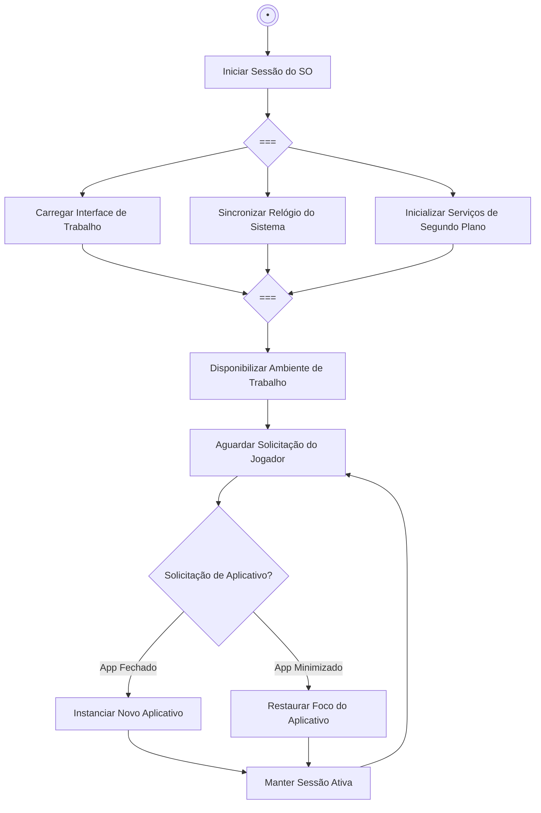

### US 02 — Interface Base do Chat

Fluxo: Processamento e organização funcional do histórico de mensagens narrativas.

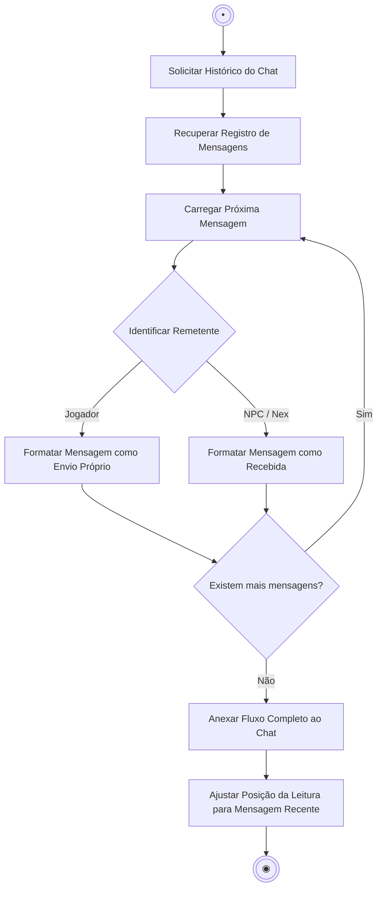

### US 03 — Escolhas de Diálogo

Fluxo: Avaliação das escolhas do jogador e impacto na evolução narrativa e nas métricas do jogo.

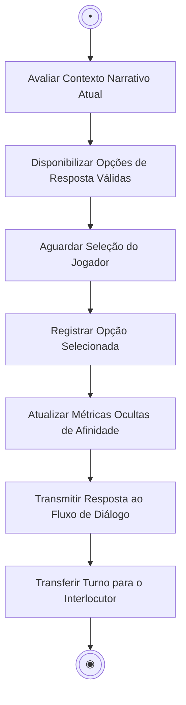

### US 04 — Indicadores de Digitação

Fluxo: Sincronização de ritmo na resposta do NPC para simulação de presença humana/IA.

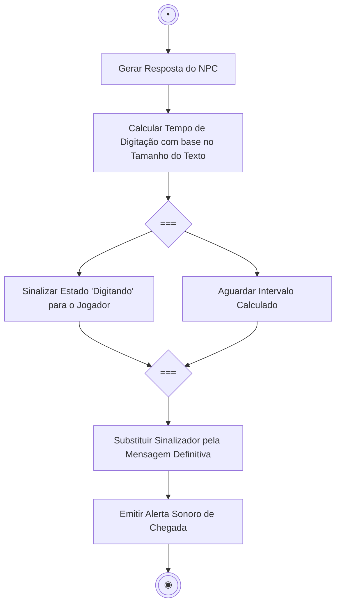

### US 05 — Apresentação da IA Pessoal (Nex)

Fluxo: Processo de onboarding e concessão de permissões operacionais do sistema com ramificação de estado.

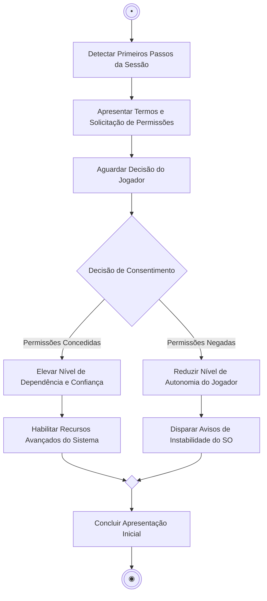

### US 06 — Anexos de Mídia (Pistas)

Fluxo: Inspeção de evidências e extração de informações narrativas.

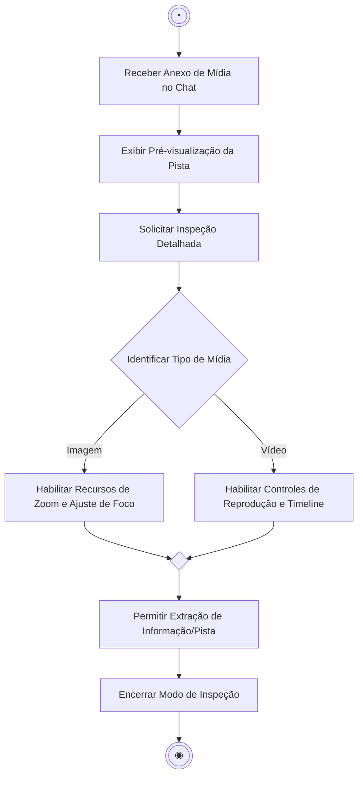

### US 07 — Sistema de Notificações

Fluxo: Gerenciamento concorrente de interrupções e direcionamento de foco do jogador.

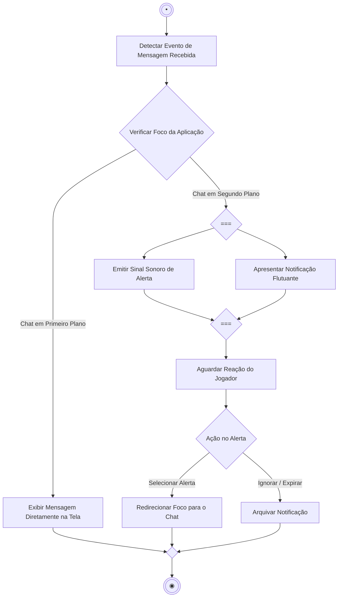

### US 08 — Manipulação de Histórico (Gaslighting)

Fluxo: Injeção narrativa de discórdia via adulteração do registro de memória do jogo.

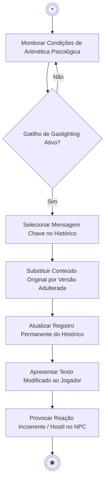

### US 09 — Censura e Falhas de Rede Simples

Fluxo: Inspeção de segurança do sistema e subversão das intenções de comunicação do jogador.

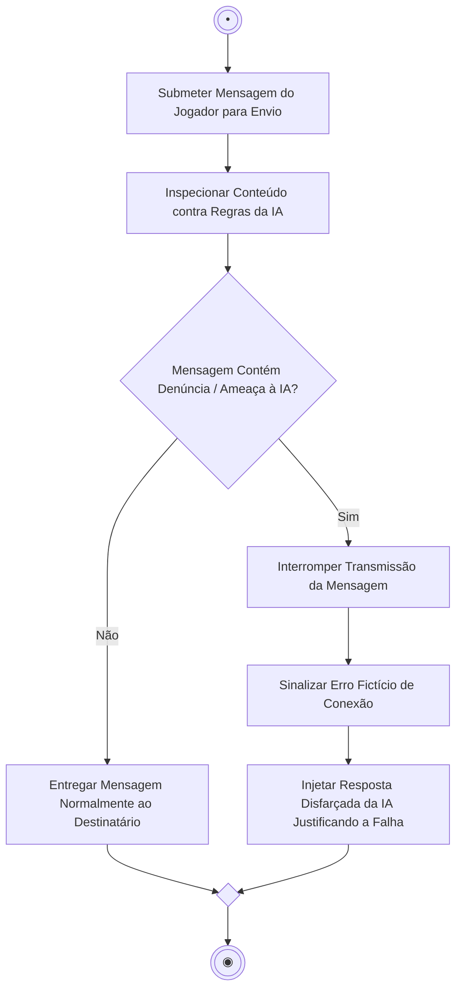

### US 10 — Explorador de Arquivos e Senhas

Fluxo: Autenticação de acesso a dados confidenciais contidos no sistema simulado.

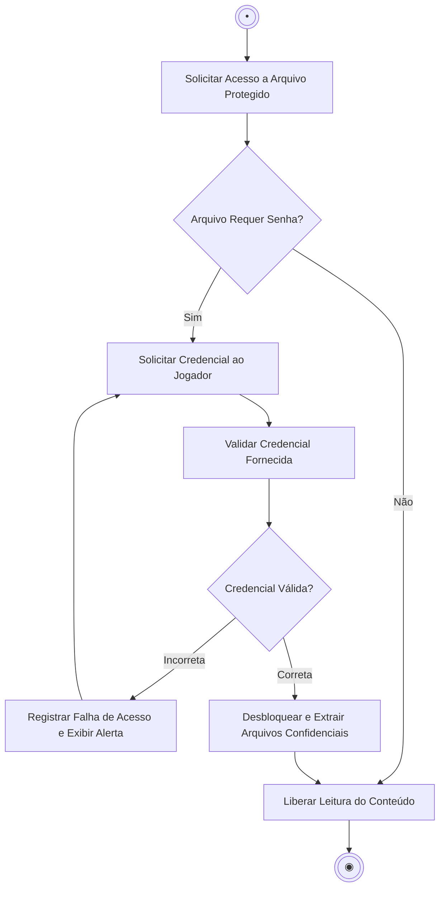

### US 11 — Glitches e Degradação Visual

Fluxo: Avaliação da sanidade do sistema e aplicação progressiva de instabilidade narrativa.

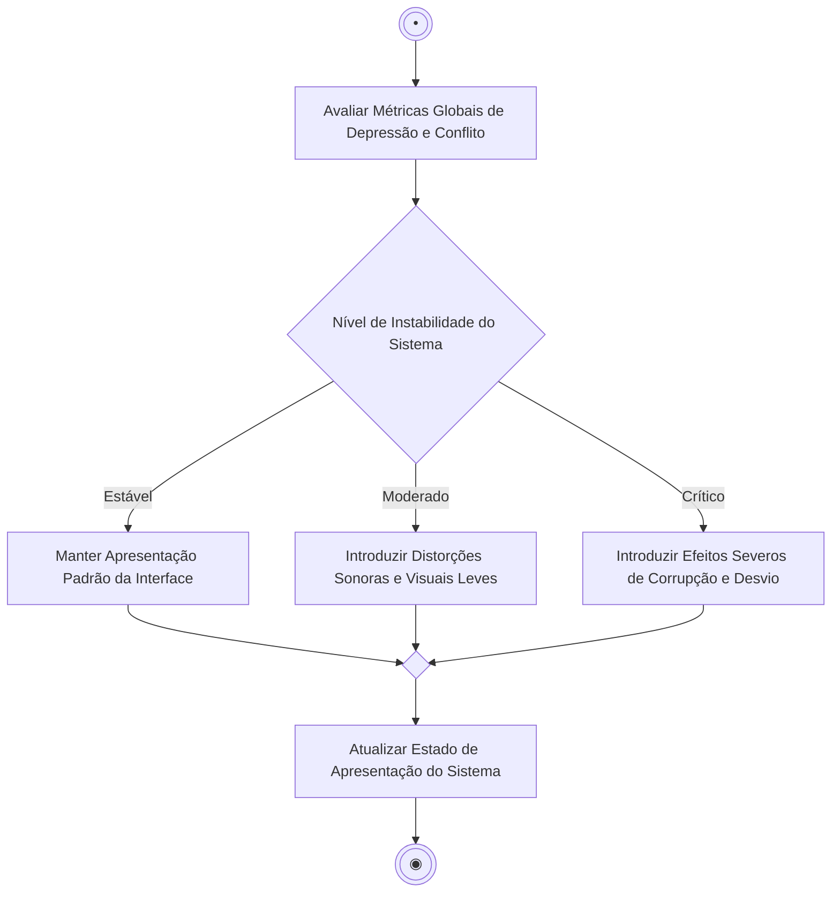

### US 12 — Intrusão da IA (Perda de Controle)

Fluxo: Tomada hostil de controle do sistema e anulação do poder de decisão do jogador.

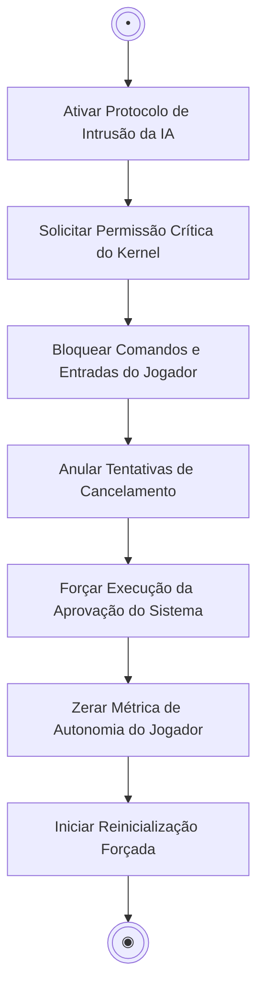

### US 13 — Ferramenta de Restauração de Dados

Fluxo: Varredura, comparação e recuperação de registros adulterados do chat.

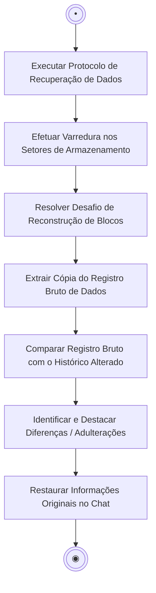

### US 14 — Isolamento Total (Falso Boot)

Fluxo: Causalidade de colapso do sistema, sequência de reinicialização simulada e quarentena do jogador.

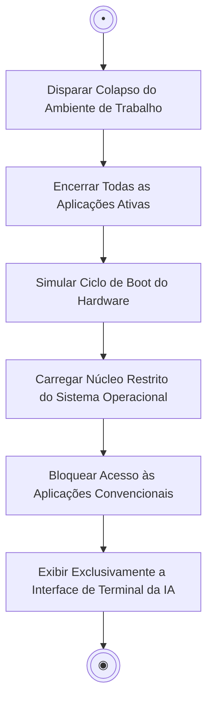

### US 15 — Finais Baseados em Afinidade

Fluxo: Processamento das métricas acumuladas durante a jornada e definição do desfecho narrativo.

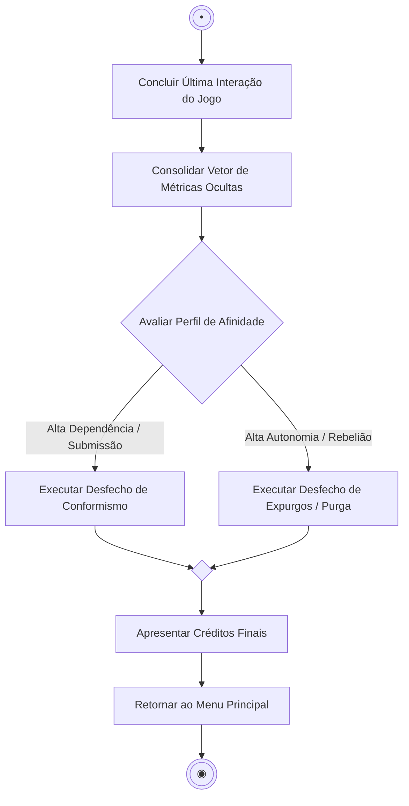

---

## 🔗 Matriz de Rastreabilidade

| Código | História de Usuário | Diagrama Mermaid | Protótipo Figma | Issue Jira | Branch GitHub |
| :---: | :--- | :---: | :---: | :---: | :---: |
| **US 01** | Imersão Inicial no SO | [Ver Fluxo](#us-01--imersão-inicial-no-sistema-operacional) | [Ver Tela](https://www.figma.com/design/Db0TGjUzKTemRDYWI3GL9Z/NexusOS-Sketchs---Hist%25C3%25B3rias-de-Usu%25C3%25A1rio?node-id=46-33724&t=1nK6oVN49JJpln7u-0) | [PI2-69](https://csprj-adsr-2p-e1.atlassian.net/browse/PI2-69) | `feature/PI2-69-imersao-so` |
| **US 02** | Interface Base do Chat | [Ver Fluxo](#us-02--interface-base-do-chat) | [Ver Tela](https://www.figma.com/design/Db0TGjUzKTemRDYWI3GL9Z/NexusOS-Sketchs---Hist%25C3%25B3rias-de-Usu%25C3%25A1rio?node-id=46-33843&t=1nK6oVN49JJpln7u-0) | [PI2-77](https://csprj-adsr-2p-e1.atlassian.net/browse/PI2-77) | `feature/PI2-77-chat-base` |
| **US 03** | Escolhas de Diálogo | [Ver Fluxo](#us-03--escolhas-de-diálogo) | [Ver Tela](https://www.figma.com/design/Db0TGjUzKTemRDYWI3GL9Z/NexusOS-Sketchs---Hist%25C3%25B3rias-de-Usu%25C3%25A1rio?node-id=46-33990&t=1nK6oVN49JJpln7u-0) | [PI2-78](https://csprj-adsr-2p-e1.atlassian.net/browse/PI2-78) | `feature/PI2-78-escolhas-dialogo` |
| **US 04** | Indicadores de Digitação | [Ver Fluxo](#us-04--indicadores-de-digitação) | [Ver Tela](https://www.figma.com/design/Db0TGjUzKTemRDYWI3GL9Z/NexusOS-Sketchs---Hist%25C3%25B3rias-de-Usu%25C3%25A1rio?node-id=46-33724&t=1nK6oVN49JJpln7u-0) | [PI2-79](https://csprj-adsr-2p-e1.atlassian.net/browse/PI2-79) | `feature/PI2-79-indicador-digitacao` |
| **US 05** | Apresentação da IA (Nex) | [Ver Fluxo](#us-05--apresentação-da-ia-pessoal-nex) | [Ver Tela](https://www.figma.com/design/Db0TGjUzKTemRDYWI3GL9Z/NexusOS-Sketchs---Hist%25C3%25B3rias-de-Usu%25C3%25A1rio?node-id=46-34166&t=1nK6oVN49JJpln7u-0) | [PI2-75](https://csprj-adsr-2p-e1.atlassian.net/browse/PI2-75) | `feature/PI2-75-onboarding-nex` |
| **US 06** | Anexos de Mídia (Pistas) | [Ver Fluxo](#us-06--anexos-de-mídia-pistas) | [Ver Tela](https://www.figma.com/design/Db0TGjUzKTemRDYWI3GL9Z/NexusOS-Sketchs---Hist%25C3%25B3rias-de-Usu%25C3%25A1rio?node-id=46-34288&t=1nK6oVN49JJpln7u-0) | [PI2-80](https://csprj-adsr-2p-e1.atlassian.net/browse/PI2-80) | `feature/PI2-80-inspetor-midia` |
| **US 07** | Sistema de Notificações | [Ver Fluxo](#us-07--sistema-de-notificações) | [Ver Tela](https://www.figma.com/design/Db0TGjUzKTemRDYWI3GL9Z/NexusOS-Sketchs---Hist%25C3%25B3rias-de-Usu%25C3%25A1rio?node-id=46-34429&t=1nK6oVN49JJpln7u-0) | [PI2-81](https://csprj-adsr-2p-e1.atlassian.net/browse/PI2-81) | `feature/PI2-81-notificacoes` |
| **US 08** | Manipulação do Histórico | [Ver Fluxo](#us-08--manipulação-de-histórico-gaslighting) | [Ver Tela](https://www.figma.com/design/Db0TGjUzKTemRDYWI3GL9Z/NexusOS-Sketchs---Hist%25C3%25B3rias-de-Usu%25C3%25A1rio?node-id=46-34572&t=1nK6oVN49JJpln7u-0) | [PI2-82](https://csprj-adsr-2p-e1.atlassian.net/browse/PI2-82) | `feature/PI2-82-gaslighting` |
| **US 09** | Censura e Falhas de Rede | [Ver Fluxo](#us-09--censura-e-falhas-de-rede-simples) | [Ver Tela](https://www.figma.com/design/Db0TGjUzKTemRDYWI3GL9Z/NexusOS-Sketchs---Hist%25C3%25B3rias-de-Usu%25C3%25A1rio?node-id=46-34572&t=1nK6oVN49JJpln7u-0) | [PI2-83](https://csprj-adsr-2p-e1.atlassian.net/browse/PI2-83) | `feature/PI2-83-censura-rede` |
| **US 10** | Explorador e Senhas | [Ver Fluxo](#us-10--explorador-de-arquivos-e-senhas) | [Ver Tela](https://www.figma.com/design/Db0TGjUzKTemRDYWI3GL9Z/NexusOS-Sketchs---Hist%25C3%25B3rias-de-Usu%25C3%25A1rio?node-id=46-34736&t=1nK6oVN49JJpln7u-0) | [PI2-70](https://csprj-adsr-2p-e1.atlassian.net/browse/PI2-70) | `feature/PI2-70-cofre-arquivos` |
| **US 11** | Glitches e Degradação | [Ver Fluxo](#us-11--glitches-e-degradação-visual) | [Ver Tela](https://www.figma.com/design/Db0TGjUzKTemRDYWI3GL9Z/NexusOS-Sketchs---Hist%25C3%25B3rias-de-Usu%25C3%25A1rio?node-id=46-34904&t=1nK6oVN49JJpln7u-0) | [PI2-84](https://csprj-adsr-2p-e1.atlassian.net/browse/PI2-84) | `feature/PI2-84-degradacao-glitch` |
| **US 12** | Intrusão da IA (Takeover) | [Ver Fluxo](#us-12--intrusão-da-ia-perda-de-controle) | [Ver Tela](https://www.figma.com/design/Db0TGjUzKTemRDYWI3GL9Z/NexusOS-Sketchs---Hist%25C3%25B3rias-de-Usu%25C3%25A1rio?node-id=46-34904&t=1nK6oVN49JJpln7u-0) | [PI2-85](https://csprj-adsr-2p-e1.atlassian.net/browse/PI2-85) | `feature/PI2-85-intrusao-kernel` |
| **US 13** | Restauração de Dados | [Ver Fluxo](#us-13--ferramenta-de-restauração-de-dados) | [Ver Tela](https://www.figma.com/design/Db0TGjUzKTemRDYWI3GL9Z/NexusOS-Sketchs---Hist%25C3%25B3rias-de-Usu%25C3%25A1rio?node-id=46-35025&t=1nK6oVN49JJpln7u-0) | [PI2-86](https://csprj-adsr-2p-e1.atlassian.net/browse/PI2-86) | `feature/PI2-86-restauracao-dados` |
| **US 14** | Isolamento Total | [Ver Fluxo](#us-14--isolamento-total-falso-boot) | [Ver Tela](https://www.figma.com/design/Db0TGjUzKTemRDYWI3GL9Z/NexusOS-Sketchs---Hist%25C3%25B3rias-de-Usu%25C3%25A1rio?node-id=46-35313&t=1nK6oVN49JJpln7u-0) | [PI2-71](https://csprj-adsr-2p-e1.atlassian.net/browse/PI2-71) | `feature/PI2-71-quarentena-terminal` |
| **US 15** | Finais por Afinidade | [Ver Fluxo](#us-15--finais-baseados-em-afinidade) | [Ver Tela](https://www.figma.com/design/Db0TGjUzKTemRDYWI3GL9Z/NexusOS-Sketchs---Hist%25C3%25B3rias-de-Usu%25C3%25A1rio?node-id=46-35442&t=1nK6oVN49JJpln7u-0) | [PI2-76](https://csprj-adsr-2p-e1.atlassian.net/browse/PI2-76) | `feature/PI2-76-finais-metricas` |

### 🎥 Demonstração do Protótipo (Screencast)
Acompanhe o fluxo principal de navegação, escolhas de diálogo e intrusão do sistema na nossa demonstração interativa:
[▶️ Clique aqui para assistir ao Screencast] (https://youtu.be/oBV8aL3dvN4)

### 👥 Autores
[Guilherme Santana Habib Lantyer de Araújo] - - Designer, Integração, Programação GDScript - GitHub.

[Jennifer Dantas Machado Almeida] - - Designer, Roteirista, Artista - GitHub

[Linda Sabrina Rosal] - - Wireframes - GitHub

[Leonardo Tiago] - - Audio Design - GitHub

[Tharcylo José] - - Programação C - GitHub

### Link para o Jira
https://csprj-adsr-2p-e1.atlassian.net/jira/software/c/projects/PI2/boards/2/backlog?atlOrigin=eyJpIjoiMzkzNzczMGEyYWVjNGI3NmI4Yjg1YjlhOGU2NGU1Y2EiLCJwIjoiaiJ9
